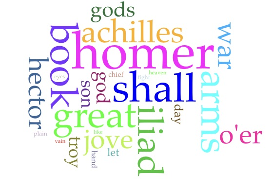



# Distant Reading Assignment 

I used Voyant and CoPilot to do distant reading on [The Iliad by Homer](https://www.gutenberg.org/files/6130/old/6130-pdf.pdf)

---
# Voyant

Using Voyant was interesting, I see how word clouds could help gain certain understandings of texts. I could see how this would be helpful to analyze a speech for themes. Voyant showed me that the most common words for this pdf were "homer," "shall," "Iliad," "great," and "book." Some other notable word in the cloud are "achilles," "hector," and "war." This tool is good for showing repeated words and phrases, but i'm not sure how useful that when it considers all the text in the document, not just the contents of the main body text. That is why it includes items like "homer," and "book." We do see "Achilles," and "war" and "hector" which points to what the Iliad is about. 

This is the word cloud I made with Voyant.

# CoPilot

Using CoPilot to analyze the Iliad was much different. With CoPilot I was able to ask target questions about the themes and possible takeaways from the Iliad. I noticed when my question was broad "tell me the major themes," it responded with a list of ten themes, which is great for diving deeper into the Iliad. For my second question, I wanted to prompt it to be more brief, so the amount of information was not overwhelming. One of using CoPilot is you can ask for specific information. I wanted to know what kind of insight the modern day writer could glean from the Iliad and it highlighted learnings from the text, the main one being inflamed ego can hurt the greater good, and lead to complete and utter chaos and devastation. 

Here are the questions I asked, and the responses the tool generated:

**Question 1: Tell me the major themes of [this](https://www.gutenberg.org/files/6130/old/6130-pdf.pdf) text. 

*Response to Question 1:*
The document you've uploaded is Alexander Pope's poetic translation of **Homer's _Iliad_**, complete with an extensive introduction by Rev. Theodore Alois Buckley and rich illustrations. Here are the **major themes** that emerge from the text:

 **1. Heroism and Glory**

- Central to the _Iliad_ is the pursuit of **kleos** (glory) through heroic deeds in battle.
- Achilles, Hector, and other warriors strive for immortal fame, even at the cost of their lives.
- The funeral games and duels (e.g., Hector vs. Ajax, Achilles vs. Hector) highlight the honor culture of Homeric Greece.

 **2. Divine Intervention and Fate**

- The gods (Zeus, Athena, Apollo, etc.) frequently interfere in mortal affairs, shaping the course of the war.
- Fate is portrayed as **inevitable and binding**, even for the gods.
- Thetis’ appeal to Zeus and the divine armor forged by Vulcan for Achilles emphasize the gods’ influence.

 **3. Wrath and Reconciliation**

- The poem opens with **Achilles’ wrath** against Agamemnon, which drives much of the narrative.
- His eventual reconciliation and return to battle mark a turning point in the war.
- The final act of compassion—Achilles returning Hector’s body to Priam—underscores the theme of reconciliation.

**4. Mortality and Grief**

- Death is omnipresent: Patroclus, Hector, Sarpedon, and eventually Achilles himself.
- The grief of Achilles, Andromache, Hecuba, and Priam reveals the human cost of war.
- The funeral rites and lamentations reflect ancient Greek views on death and remembrance.

**5. Honor and Shame**

- Honor is earned through bravery, loyalty, and prowess in battle.
- Shame results from cowardice or failure to uphold social and martial expectations (e.g., Paris fleeing from Menelaus).
- The tension between personal honor and communal duty is a recurring conflict.

 **6. The Role of Women**

- Helen, Briseis, Andromache, and Hecuba are central to the emotional and political stakes.
- Women are often portrayed as prizes or mourners, yet their voices (especially Helen’s and Andromache’s) add depth to the narrative.

**7. Legacy and Poetic Tradition**

- Buckley’s introduction and Pope’s preface explore Homer’s literary legacy.
- Homer is positioned as the “father of poetry,” influencing generations of poets and thinkers.
- Pope’s translation emphasizes elegance and poetic form over literal accuracy, reflecting 18th-century literary values.

Would you like a breakdown of the themes by book or character? Or perhaps a visual map of the character relationships and divine influences?

**Question 2: Briefly give 3 takeaways for present day readers

*Response to Question 2*
Here are three brief takeaways from Homer’s _Iliad_ for present-day readers:

 **1. The Cost of Pride**

Achilles’ refusal to fight over a personal insult shows how unchecked ego can harm the greater good. Today, this reminds us that pride can sabotage teamwork and progress.

 **2. The Power of Empathy**

Despite the brutality of war, moments like Achilles returning Hector’s body to Priam highlight the human capacity for compassion—even between enemies.

 **3. Fate vs. Free Will**

The tension between destiny and choice in the _Iliad_ encourages reflection on how much control we truly have over our lives—and how we respond to what we can’t control.

Would you like these adapted into a visual or quote-style format for sharing?

